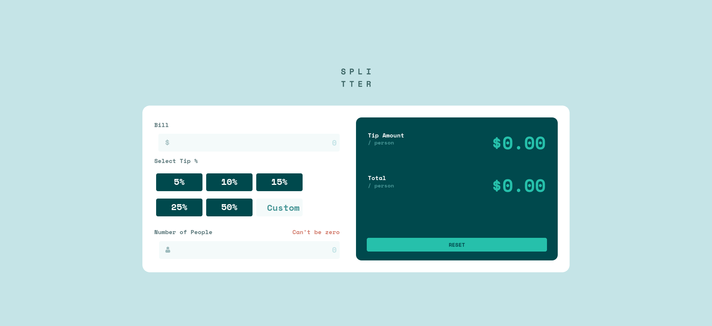
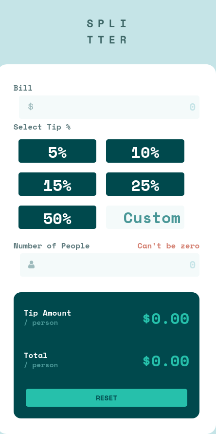

# Frontend Mentor - Tip calculator app solution

This is a solution to the [Tip calculator app challenge on Frontend Mentor](https://www.frontendmentor.io/challenges/tip-calculator-app-ugJNGbJUX). Frontend Mentor challenges help you improve your coding skills by building realistic projects.

## Table of contents

- [Overview](#overview)
  - [The challenge](#the-challenge)
  - [Screenshot](#screenshot)
  - [Links](#links)
- [My process](#my-process)
  - [Built with](#built-with)
  - [What I learned](#what-i-learned)
- [Author](#author)

## Overview

### The challenge

Users should be able to:

- View the optimal layout for the app depending on their device's screen size
- See hover states for all interactive elements on the page
- Calculate the correct tip and total cost of the bill per person

### Screenshot

### Links

- [Solution URL](https://github.com/jmgisele/tip-calculator-app-main/)
- [Live Site URL](https://jmgisele.github.io/tip-calculator-app-main/)

## My process
I started with mobile and then switched to desktop once mobile looked alright. I quickly learned it would have been smarter to plan out my use of flexbox originally, rather than using magic numbers to make the mobile design look exactly like the screenshot. But redesigning for desktop also helped the mobile design use less random margins etc and rely more on basic flexbox, which helped it look cleaner on a broader variety of devices.
### Built with

- Semantic HTML5 markup
- CSS custom properties
- Flexbox
- Mobile-first workflow

### What I learned

I am definitely going to spend 15 minutes problem solving my flexbox/grid plans before diving into CSS moving forward. This was also my first javascript project, so a lot of very basic things (when to call a function and when to call its result, etc) were figured out in the process.

## Author

- Github - [@jmgisele](https://github.com/jmgisele)
- Frontend Mentor - [@jmgisele](https://www.frontendmentor.io/profile/jmgisele)

